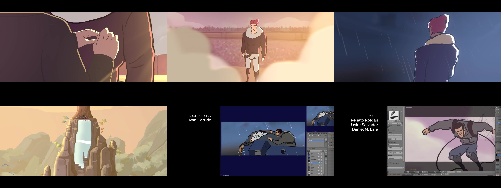

# Description
Makes a image collage for all video files OR image files in targeted folder and all subfolders. Saves them in a /collage folder as .jpg file.

Video format support: **.mp4, .mkv, .avi, .mov, .flv, .wmv**<br>
Image format support: **.jpg, .jpeg, .png**


*Image credit: Blender Foundation*

### Usage
Go to the root folder and type **deno run** on the main file. The permissionss are required for the code to run. 

```
deno run --allow-read --allow-write --allow-run=ffmpeg,ffprobe,magick main.ts -d "/path/to/videos"
```

Make sure the path is correct and is either using single slash `C:/Users/Videos` or double backslash `C:\\Users\\Videos`

Example usage when in root folder:     
#### Create a collage for video files in a directory:
    deno run --allow-read --allow-write --allow-run=ffmpeg,ffprobe,magick main.ts -d "/path/to/videos"

##### Creates a collage in "./pictures" for video files over 5 minutes long while removing the screenshots after collage creation:
    deno run --allow-read --allow-write --allow-run=ffmpeg,ffprobe,magick main.ts -d "/path/to/videos" -l 5 -o ."/pictures"
      
##### Create a collage for image files while keeping the screenshots after collage creation in a 5x2 layout:
    deno run --allow-read --allow-write --allow-run=ffmpeg,ffprobe,magick main.ts -d "/path/to/videos" -i -k -c "5x2"

For more specific details on run following command in terminal
```
deno main.ts --help
```
## Prerequisites

This tool requires the following software to be installed:

- [FFmpeg](https://ffmpeg.org/) - A complete cross-platform solution for video handling
- [ImageMagick](https://imagemagick.org/) - Software suite for displaying, converting, and editing image files
- [Deno](https://docs.deno.com/runtime/getting_started/installation/) - Javascript runtime

Double check if ffmpeg imagemagick and deno can be run in the terminal.

